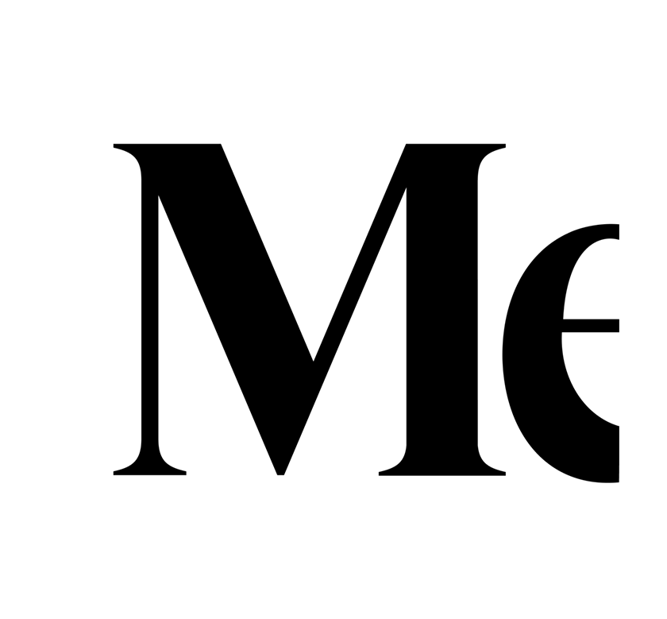

<h1 align="center">Hi 👋, I'm Binara Wijewickrama</h1>
<h3 align="center">A passionate cybersecurity professional from Sri Lanka, specializing in cybersecurity, AI, and cloud
    computing.</h3>
    

  

  

- 🔭 I’m currently working on [cookisniffer](https://github.com/mrcookee/cookisniffer)

- 🌱 I’m currently learning **Web Application Pentesting**

- 👯 I’m looking to collaborate on **Cyber Security Projects**

- 👨‍💻 All of my projects are available at [portfolio](portfolio)

- 📝 I regularly write articles on [Medium](https://medium.com/@binarawijewickrama)

- 💬 Ask me about **Python,C,and Bootstrap 5**

- ⚡ Fun fact **The code compiles without errors 😂**

<h3 align="left">Latest Articales</h3>
# Blog posts
<!-- BLOG-POST-LIST:START -->
<!-- BLOG-POST-LIST:END -->

<h3 align="left">Programming Languages</h3>

    
    
    
    
    

<h3 align="left">Frontend Technologies</h3>

    
    
    

<h3 align="left">Backend & Backend as a Service (Baas)</h3>

    
    
    
    </a> 

<h3 align="left">Softwares</h3>

    
    
    
    
    

<h3 align="left">Connect with me:</h3>

    
    

